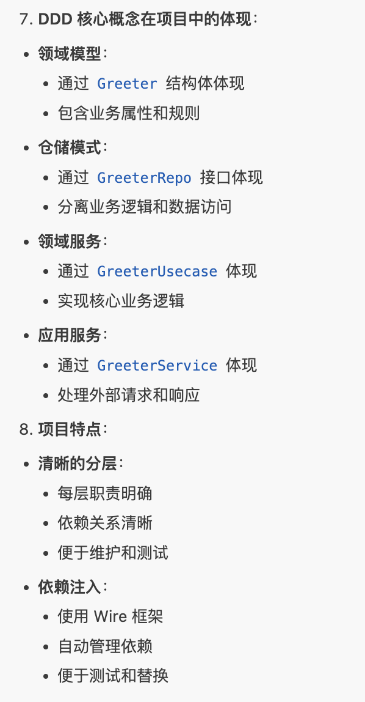

1. cmd层的wire.go，依赖注入是什么
2. 数据层 -> 业务层 -> 服务层

ddd领域驱动设计+clean architecture

1. 数据层：封装api或者外部数据库访问，具体实现
2. 业务层抽象接口：只依赖接口，不依赖具体实现
3. 服务层：处理请求、接收参数、返回响应；与外界交互http/grpc

解耦的意义，代码规范

1. 数据层 - 最底层：实现业务层的接口，对方法的实现；调用数据库/第三方接口
2. 业务层 - 中间层：定义接口，由数据层去实现，可以替换不同的数据层从而；执行业务逻辑
3. 服务层 - 最上层：实现api方法，定义返回；grpc服务定义包含

swagger editor 用来交互前后端，可视化接口

proto加了这个google.api.http以后，既可以http也可以grpc

客户端可以http的请求，也可以用grpc直接调用方法；同一个方法实现（代码复用）

gorm数据库框架，封装好了不同数据库的使用方法接口

docker 起数据库

dokcer-compose和其一些指令，用来启动镜像服务

dokcer可视化

wire - 注入，在外层进行初始化依赖注入实例
